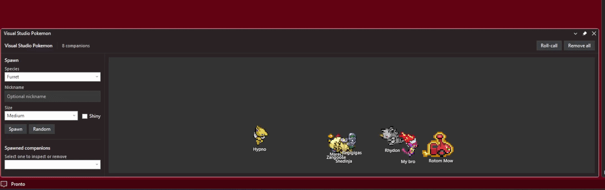
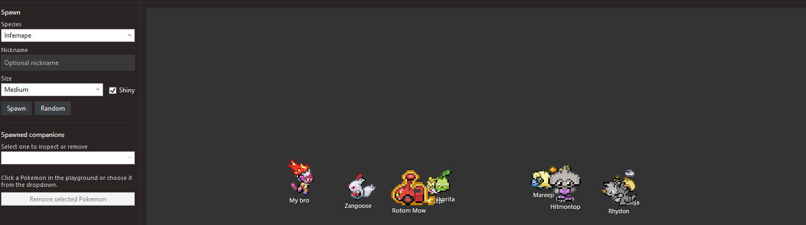

# Visual Studio Pokémon

Bring Pokémon to Visual Studio! Add an animated Pokémon companion to your IDE while you code.

> Inspired by the excellent vscode-pokemon extension by Jakob Hoeg, but built specifically for Microsoft Visual Studio.

<p align="center">
  <!-- Hero GIF goes here -->
  
</p>

---

## Features

- 🎮 Animated Pokémon companion inside Visual Studio
- ✨ Smooth animated GIF sprites
- 📏 Multiple Pokémon sizes
- 🔄 Easily switch between Pokémon species
- 💾 Remembers your selected Pokémon between Visual Studio sessions
- ⚡ Lightweight and designed specifically for Visual Studio

---

## Screenshots

Pokémon

<!-- Replace with your screenshot -->

<p align="center">
  
</p>

---

## Installation

### Visual Studio Marketplace

Install directly from the Visual Studio Marketplace.

> *(Marketplace link coming soon)*

Or install the generated `.vsix` manually.

---

## Usage

After installing the extension:

1. Open Visual Studio.
2. Open the **View** menu.
3. Select **Pokémon**.
4. Choose your favorite Pokémon.
5. Enjoy coding with your new companion!

The selected Pokémon will automatically be restored the next time Visual Studio starts.

---

## Available Pokémon

Current release includes support for multiple Pokémon species.

More Pokémon will be added in future updates.

---

## Customization

You can customize:

- Pokémon species
- Pokémon size

Future versions may include additional customization options.

---

## Building

Clone the repository:

```bash
git clone https://github.com/FabioMusi04/VS2026-Pokemon.git
```

Open the solution in Visual Studio and build the project.

To test the extension:

- Press **F5**
- An Experimental Visual Studio instance will launch with the extension installed.

---

## Roadmap

- [ ] Pokéball animation on opening/closing of UI or on pokemon Spawn/Remove

---

## Contributing

Contributions are welcome!

Feel free to open an issue or submit a pull request.

---

## Inspiration

This project was inspired by the wonderful **vscode-pokemon** project by Jakob Hoeg.

This is an independent implementation built for Microsoft Visual Studio and is **not affiliated** with the original project.

---

## License

This project is licensed under the MIT License.

See the [LICENSE](LICENSE) file for details.

---

## Acknowledgements

- Inspired by **vscode-pokemon**
- Thanks to everyone contributing Pokémon sprite resources and open-source tooling.